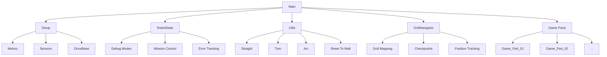
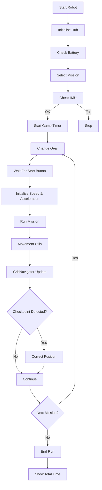

# 🚀 ROBO +isis

### MONA — Unearthing Innovation

> _We didn’t just build a robot.  
> We built a system that knows where it is._

----------

# 🧠 Project Overview

This repository contains the full software architecture of our competition robot, designed for modular execution, precision movement, and intelligent navigation.

The system is built using **PyBricks** and is structured around:

-   Mission-based execution (Game Parts)
-   Advanced motion control
-   Custom gearbox system
-   Real-time state tracking
-   Experimental grid-based localization system

----------

# 💡 Innovation — Grid Navigation System

One of the most innovative parts of our system is the **GridNavigator**

### 🔲 Idea

We transformed the field into a **virtual chessboard**.

-   Each square ≈ robot size
-   Robot always knows where it is
-   Movement becomes deterministic, not blind

### 👁️ How it works

-   2 color sensors (left & right)
-   Detect combinations like:
    -   green / brown
    -   brown / green
-   Each combination maps to a **specific grid cell**

("green", "brown", "A1") → (1,1)

### 🧭 Result

✔ Localization without vision  
✔ Self-correction using checkpoints  
✔ No drift-based navigation only

## 🧭 System Architecture

Below is a simplified view of our system:

  
## 🚦Execution Flow  
  
This diagram shows how the robot operates during a run:

# ⚙️ Architecture

The system is designed with **clean modular separation**:

Main  
 ├── Setup (hardware & constants)  
 ├── RobotState (global state)  
 ├── Utils (movement & tools)  
 ├── GridNavigator (localization)  
 └── Game Parts (missions)

----------

# 🧩 Core Components

## 🔹 RobotState

Central brain of the system

Handles:

-   Debug modes
-   Mission enabling/disabling
-   Gear state
-   Movement error tracking
-   Runtime statistics

✔ Eliminates global variables  
✔ Enables dynamic strategy

----------

## 🔹 Setup

Hardware configuration

Includes:

-   Motors & sensors
-   DriveBase
-   Constants (speed, acceleration)
-   Timers

----------

## 🔹 Utils

Movement & control layer

Provides:

-   `Turn()`
-   `Straight()`
-   `Arc()`
-   `Reset_Wheels_To_Wall()`
-   `Turn_With_Timeout()`

✔ Gyro-based correction  
✔ Error tracking  
✔ Async execution

----------

## 🔹 GridNavigator

Localization system

Features:

-   Grid mapping (A1 → coordinates)
-   Sensor-based checkpoints
-   Position tracking
-   Debug integration

----------

# 🎮 Mission System (Game Parts)

Each mission is a **separate module**:

Game_Part_01  
Game_Part_02  
...  
Game_Part_09

Each file contains:

async  def  Run_Mission():

Example

✔ Fully independent  
✔ Easy debugging  
✔ Restart from any mission

----------

# 🧠 Mission Execution Logic

We use a **mission-based dictionary system**:

GAME_PARTS  = {  
  1: (Run_Mission, gear),  
}

✔ No index problems  
✔ Skip missions safely  
✔ Always correct mapping (7 → Game Part 7)

----------

# 🎯 Key Features

## ⚙️ Gearbox Control

-   Dynamic gear switching per mission
-   Optimized torque / speed balance

## 🧠 Smart Execution

-   Missions can be enabled/disabled live
-   Strategy changes without rewriting code

## 📊 Error Tracking

-   Turn error
-   Distance error
-   Drift monitoring

## 🔄 Async Multitasking

Example:

await  multitask(  
  Straight(400),  
  Move_Caliper(...)  
)

✔ Parallel actions  
✔ Faster runs

----------

# 🤖 Robot Capabilities

-   Dual motor drive
-   Multi-output mechanisms
-   Caliper system for interactions
-   Precision gyro turning
-   Wall alignment system

----------

# 🛠️ How to Run

1.  Upload code to PyBricks
2.  Start robot
3.  Select mission from hub menu
4.  Press center button to execute

----------

# 🧠 Future Improvements

-   Full grid navigation integration in missions
-   Auto path planning
-   Adaptive correction using drift data

----------

# 👥 Team Robo+ART(ήσεις)

Innovation meets precision.  
Engineering meets strategy.

----------

# 🚀 TL;DR

✔ Modular architecture  
✔ Smart mission system  
✔ Real-time state tracking  
✔ Experimental localization system

----------
    
